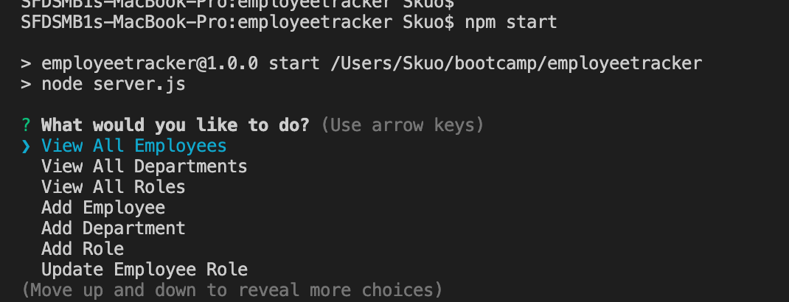
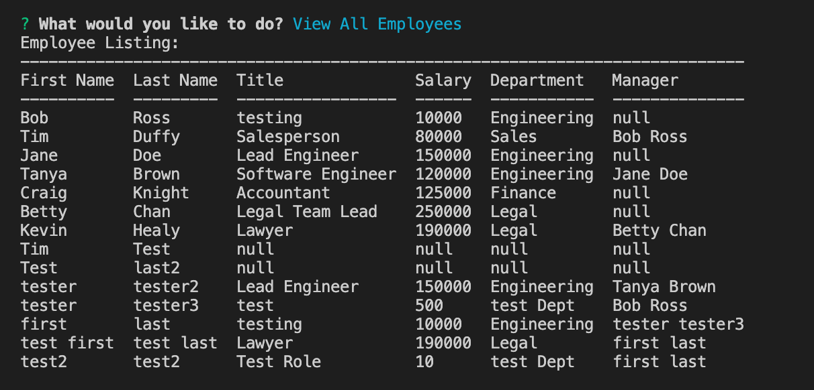
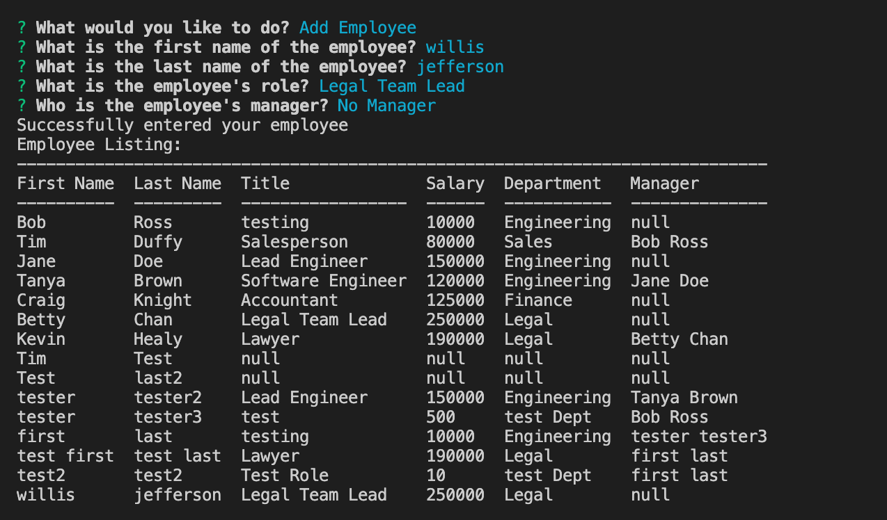

## Name and live url
Stephanie Kuo Week12 - Employee Tracker
https://sfds1.github.io/employeetracker/


## Description
This is an application that is a a solution for managing a company's employees using node, inquirer, and MySQL.

## What does the app do?
This site is a command-line application that allows users to:

  * Add departments, roles, employees

  * View departments, roles, employees

  * Update employee roles

## How does it work?
The application  will be invoked with the following command:

```sh
npm start
```

## Technologies
Node, Javascript, MySQL

## Languages, frameworks, various tools
This application uses Node packages Inquirer, console.table and MySQL.

## Challenges
The basic design was not so bad, but I am trying to re-factor the code I have in the server.js to be cleaner.  That has been a challenege as there is lot to do with promises, async and wawait and contructor functions.  

## Your experience building this app
The hard part is trying to figure out how to refactor the code so I don't have to make the same calls but still show the data in a nice way

## What was difficult
Constructor functions

## What did you learn
I am still learning about constructor functions and how they deal with renaming column headers for viewing.


## How did you go about solving a problem
This time around I asked my tutor as I didn't have time to research other ways 

## Screenshot






## Live app, not code

